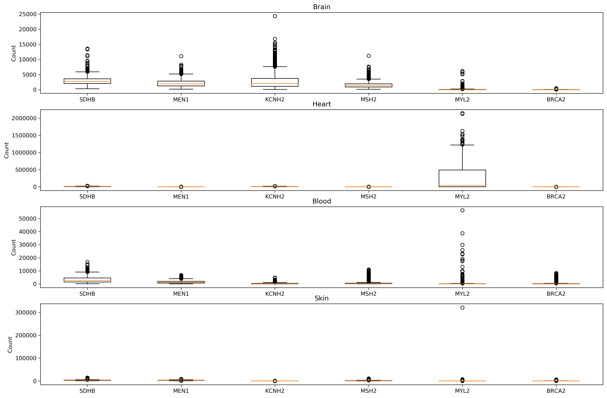

[](https://travis-ci.com/cu-swe4s-fall-2019/workflow-jgkawell)

# workflow-jgkawell

## Description
This repository contains Python code for plotting gene counts according to tissue type.

## How to use
The project is meant to be used by calling the Python scripts from the terminal. There are various input parameter best described by the argparse help output for each file:

```
usage: get_gene_counts.py [-h] [--file_name FILE_NAME] [--gene_name GENE_NAME]
                          [--out_file_name OUT_FILE_NAME]

Creates a file with the sample idsand counts for a given gene.

optional arguments:
  -h, --help            show this help message and exit
  --file_name FILE_NAME
                        The file containing gene data
  --gene_name GENE_NAME
                        The gene to get counts for
  --out_file_name OUT_FILE_NAME
                        The file to save count data to
```

```
usage: get_tissue_samples.py [-h] [--file_name FILE_NAME]
                             [--tissue_name TISSUE_NAME]
                             [--out_file_name OUT_FILE_NAME]

Creates a file with the sample idsfor a given tissue group.

optional arguments:
  -h, --help            show this help message and exit
  --file_name FILE_NAME
                        The file containing sample attributes
  --tissue_name TISSUE_NAME
                        The tissue to get samples for
  --out_file_name OUT_FILE_NAME
                        The file to save count data to
```

```
usage: box.py [-h] [--tissues TISSUES [TISSUES ...]]
              [--genes GENES [GENES ...]] [--out_file_name OUT_FILE_NAME]

Creates a box plot of tissues and genes

optional arguments:
  -h, --help            show this help message and exit
  --tissues TISSUES [TISSUES ...]
                        The tissues to plot
  --genes GENES [GENES ...]
                        The genes to plot
  --out_file_name OUT_FILE_NAME
                        The file to save the plot to
```

So you can simply run the program by calling:

```
python plot_gtex.py [options]
```

You will then be given a plot in the output file you have chosen that will look something like the one below:



This can easily be done by calling `snakemake` with the provided snakemake file
